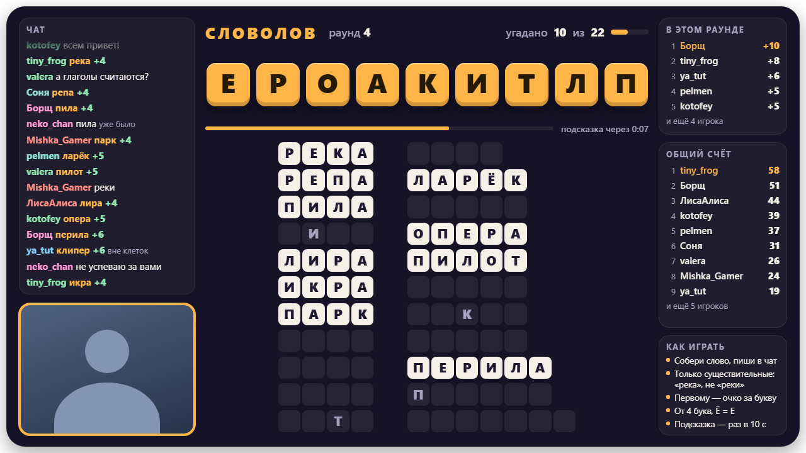
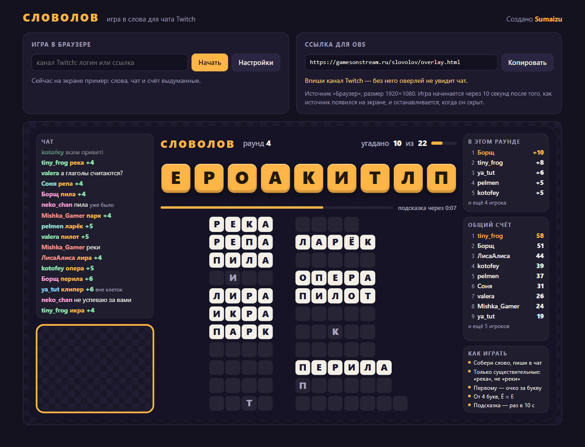
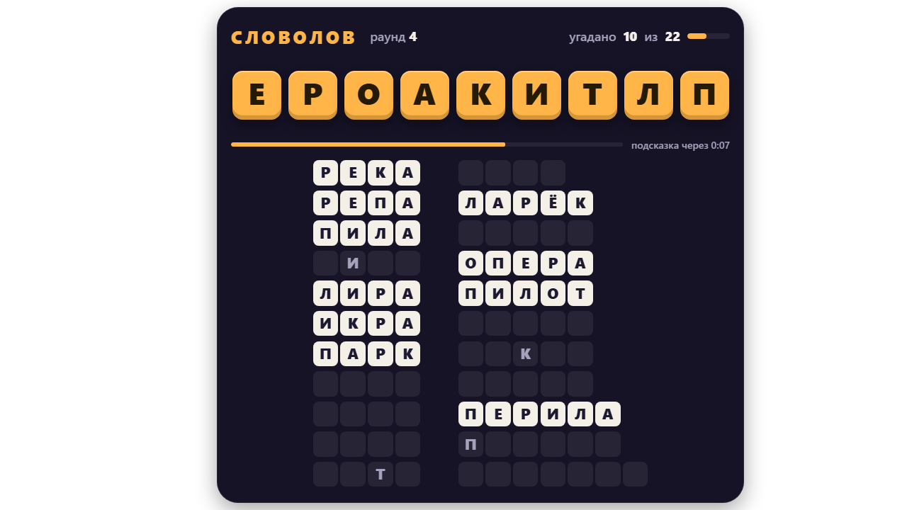

# Словолов

Игра в слова для чата Twitch — на русском языке. На экране стрима появляются буквы, зрители собирают из них слова и
пишут в чат. Кто первым написал слово — получает очки.



**[gamesonstream.ru/slovolov](https://gamesonstream.ru/slovolov/)** — играй прямо в браузере или вставь ссылку в OBS.

Ставить ничего не нужно: ни программ, ни регистрации, ни ключей Twitch. Сервера у игры нет — она сама читает чат и
сама ведёт раунды прямо в браузере.

## Как запустить



**В браузере.** Открой [gamesonstream.ru/slovolov](https://gamesonstream.ru/slovolov/), впиши свой канал Twitch и
нажми «Начать». Через 10 секунд на странице пойдёт первый раунд, дальше раунды идут сами. Пока игра не начата, на её
месте пример с выдуманными словами, чатом и счётом.

**В OBS.** На той же странице скопируй «Ссылку для OBS» и вставь её в источник «Браузер»: ширина 1920, высота 1080.
Игра начнётся через 10 секунд после того, как источник появился на экране.

Кнопка «Настройки» открывает панель рядом с игрой. Сохранять ничего не нужно: правки сразу действуют на игру в
браузере, а ссылка для OBS обновляется сама.

Что полезно знать про OBS:

- **Сцены.** Скрыл источник или ушёл на другую сцену — игра остановилась. Вернулся — новый отсчёт и новое слово.
  Можно ещё отметить в свойствах источника «Отключать источник, когда он не виден»: тогда OBS сам выключает игру
  вместе с источником.
- **Вебка.** Окошко под вебку прозрачное: источник с камерой поставь в OBS под оверлей и подгони под рамку.
- **Звук** идёт из источника. Чтобы у игры была своя дорожка в микшере, включи в свойствах источника «Управление
  аудио через OBS».
- **Настройки зашиты в ссылку.** Поменял настройки — вставь в OBS новую ссылку.
- **Общий счёт хранится в OBS.** Нужна игра в нескольких сценах — добавляй тот же источник («Добавить
  существующий»), а не новый: два разных источника с одной ссылкой — это две игры сразу.
- **Обновления.** Оверлей сам замечает, что игра обновилась, и перезагружается между раундами.

## Правила

- На экране — буквы одного длинного слова, перемешанные. Из них нужно собирать слова и писать в чат: **одно
  сообщение — одно слово**.
- Годятся **существительные в начальной форме**: «река», «парта», «сани». Имена, города и ругательства не
  считаются. Не считаются и уменьшительные слова («садик», «разок»), и прилагательные в роли существительных
  («старое»).
- Каждую букву можно взять столько раз, сколько она есть на плашках. «Ё» и «е» — одна буква: «ёлка» можно написать
  как «елка».
- Слово достаётся тому, кто написал его первым. **Одна буква — одно очко**: за «река» — 4, за «реплика» — 7.
- Раунд идёт, пока не открыты все слова в клетках. Потом на экране итоги — кто сколько набрал, — и через 20 секунд
  начинается следующий раунд.
- Раз в 30 секунд буквы на плашках перемешиваются: порядок новый — и слова видны новые.
- Угаданное слово на секунду подсвечивается в клетках — видно, что открыли последним.
- **Подсказки.** Если 10 секунд никто ничего не угадал, в одном случайном закрытом слове открывается одна случайная
  буква. Слово, которое подсказки открыли целиком, закрывается без очков.
- **Свободные клетки.** Загаданы только ходовые слова, но клетки достаются не только им. Зритель написал другое
  настоящее слово, и клетки такой длины ещё свободны — слово встаёт в них, а загаданное уступает место.
- **Слова вне клеток.** Свободных клеток нужной длины нет — настоящее слово всё равно приносит очки, а в чате на
  экране помечено «вне клеток». Слово, которое уже кто-то написал, помечено «уже было».
- **Добавленные буквы.** К буквам главного слова игра добавляет ещё две: слово из шести букв и две добавленные —
  на плашках восемь букв, и слова собираются из всех восьми. Какие буквы добавлены, видно в итогах раунда.
- **Общий счёт** копится от раунда к раунду. Его обнуляет команда в чате или расписание из настроек.

## Команды в чате

Для стримера и модераторов:

```
!словолов-раунд    закончить раунд; на итогах — сразу начать следующий
!словолов-сброс    обнулить общий счёт
```

## Настройки

| Настройка | По умолчанию | Что делает |
| --- | --- | --- |
| Канал Twitch | — | Чей чат читать: логин или ссылка на канал |
| Команды для стримера и модераторов | включены | `!словолов-раунд` и `!словолов-сброс` |
| Пауза между раундами | 20 с | Сколько на экране висят итоги |
| Подсказка | 10 с | Через сколько секунд без угаданных слов открывается буква. 0 — без подсказок |
| Перемешивать буквы | 30 с | Сколько секунд между перемешиваниями плашек. 0 — не перемешивать |
| Лимит времени на раунд | 0 | 0 — раунд идёт, пока не открыты все слова |
| Главное слово | 5–8 букв | Длина слова, из букв которого собираются остальные |
| Добавить букв к главному слову | 2 | Сколько букв добавить на плашки сверх главного слова, от 0 до 4 |
| Самое короткое слово | 4 буквы | Слова короче не считаются |
| Слов в раунде | от 6 до 45 | Сколько слов загадано. Самое большее — 45: три столбика по пятнадцать |
| Сбрасывать общий счёт | только командой | Или сам: каждый день, неделю, месяц — в заданный час — либо по таймеру |
| Звуки и громкость | включены, 100% | Отсчёт, начало раунда, угаданное слово, подсказка, перемешивание, итоги |
| Цвет плашек с буквами | янтарный | Цвет плашек и всех акцентов оверлея |
| С вебкой / без вебки | с вебкой | Без вебки место окошка занимает чат |
| Скрыть чат | нет | Убирает левую панель целиком: чат и окошко под вебку |
| Убрать счёт и правила | нет | Убирает правую панель |
| Прозрачный фон | нет | Без тёмной подложки — если под игрой свой фон |

Значения по умолчанию — рекомендуемые: с ними страница открывается в первый раз, к ним же возвращает кнопка
«Рекомендуемые настройки».

Когда панели скрыты, поле игры остаётся на месте и того же размера — меньше становится только рамка вокруг.



## Что на экране

- **Поле игры** вмещает до 45 слов. Размер клеток оверлей считает сам — под число слов и их длину.
- **Чат** показывает все сообщения зрителей, угаданные слова в нём подсвечены. Смайлики Twitch, 7TV, BetterTTV и
  FrankerFaceZ показываются картинками. Сообщения известных ботов в чат не попадают. Если модератор удалил
  сообщение или забанил зрителя, с экрана оно тоже пропадает.
- **Счёт.** Счёт раунда и общий счёт занимают весь столбик справа. Когда игроков больше, чем помещается, в общем
  счёте остаётся первая десятка, а остальное место достаётся раунду.
- **Правила** в правом нижнем углу подстраиваются под настройки.
- **Автор игры в чате.** Ник разработчика «Словолова» (Sumaizu на Twitch) вшит в игру: если он заглянет на стрим,
  его ник будет переливаться радугой, а сообщения в чате — стоять в золотой рамке. Так автора можно узнать на любом
  стриме, где идёт игра.

## Словарь

В игре около 48 тысяч существительных. Чтобы раунд можно было закрыть, загадываются только слова, которые знает
почти каждый: у слова есть оценка «ходовости», посчитанная по двум большим корпусам — разговорной речи (субтитры) и
детских книг. Редкие слова тоже принимаются: они встают в свободные клетки или идут как слова вне клеток.

Словарь собирается из открытых данных и нескольких списков, набранных вручную:

| Файл | Что в нём |
| --- | --- |
| `tools/extra_nouns.txt` | Современные слова, которые знает каждый: «стрим», «лайк». Игра может их загадать |
| `tools/more_nouns.txt` | Остальные настоящие слова, которых не было в источнике. Оценка — по корпусам |
| `tools/not_common.txt` | Слова, за которыми в корпусах прячутся имена и другие части речи. Не загадываются |
| `tools/not_in_cells.txt` | Грубое и двусмысленное: в клетки не ставится, засчитывается только вне клеток |
| `tools/not_words.txt` | Уменьшительные слова и прилагательные в роли существительных: в словарь не попадают |
| `site/data/blocklist.txt` | Мат, оскорбления и откровенная лексика: этих слов в игре нет совсем |

В списках слова идут через пробел или с новой строки. В первых двух строка из слова и числа задаёт слову оценку.

Нашлось слово, которого в игре нет, или игра загадала что-то странное — поправь списки и пересобери словарь:

```
pip install pymorphy3 pymorphy3-dicts-ru
python tools/build_dictionary.py
```

Скрипт скачает исходные данные (около 30 МБ) в `tools/_cache/` и соберёт `site/data/nouns_ru.tsv`. Сборка идёт
одну-две минуты.

## Для разработчиков

Игра — статические страницы на чистом JavaScript: без сборки и без сторонних библиотек.

```
site/index.html        главная страница: игра в браузере, настройки, ссылка для OBS
site/overlay.html      оверлей
site/js/page.js        главная страница
site/js/overlay.js     запуск оверлея: сам по себе в OBS или внутри главной страницы
site/js/words.js       словарь: какие слова собираются из букв, какое слово взять на раунд
site/js/engine.js      правила: раунды, очки, подсказки
site/js/chat.js        чтение чата Twitch без токена
site/js/config.js      настройки и их упаковка в ссылку
site/js/view.js        отрисовка оверлея
site/js/sound.js       звуки
site/js/emotes.js      смайлики 7TV, BetterTTV и FrankerFaceZ
site/js/demo.js        пример, который виден, пока игра не начата
site/data/             словарь и список запретов
tests/js/              тесты
tools/                 локальный сервер, запуск тестов, снимки для README, сборка словаря
```

Запустить у себя — `site.bat` или `python tools/serve.py`: откроется `http://127.0.0.1:8770/`. Нужен Python 3.9
или новее.

Тесты идут в скрытом браузере (Edge или Chrome):

```
pip install websocket-client
python tools/jstest.py
```

Картинки для этой страницы снимает `python tools/shots.py`.

Сайт выкладывается на GitHub Pages сам: когда в ветку `main` приходят изменения в папке `site/`, она публикуется
целиком (`.github/workflows/pages.yml`).

## Лицензия

Играть на своих стримах можно свободно — в том числе на стримах с донатами, подписками и рекламой.

Код открыт только для некоммерческого использования — лицензия
[PolyForm Noncommercial 1.0.0](LICENSE.md). Его можно читать, копировать и менять для себя. Продавать игру, её копии
и переделки, брать плату за доступ к ним и зарабатывать на них любым другим способом без разрешения автора нельзя.
За разрешением — к автору: [twitch.tv/sumaizu](https://twitch.tv/sumaizu).

Словарь собран из открытых данных и распространяется на условиях CC BY-SA 4.0 — источники и подробности в
[site/data/LICENSE-DATA.md](site/data/LICENSE-DATA.md).

Проект не связан с Words on Stream и Twitch.
